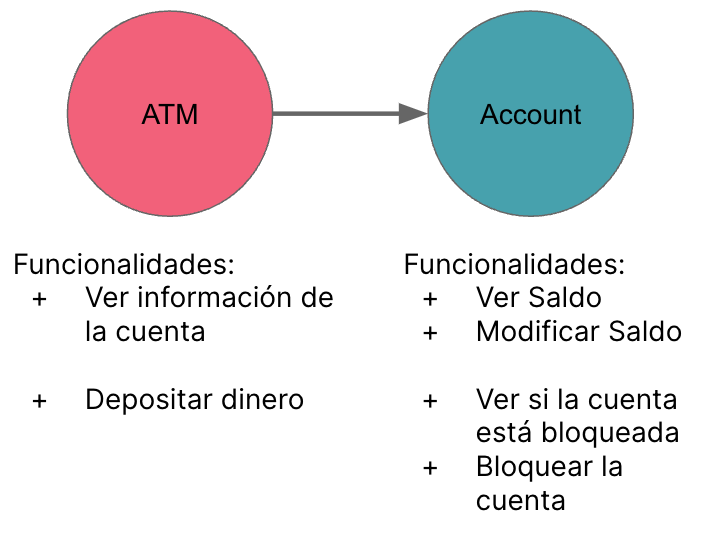

# workshop-introduccion-al-testeo-en-javascript
Workshop para introduccion al testeo en Javascript

## Descripcion
Queremos crear un banco online. Por simplificar el ejemplo, este banco online guardara todo en memoria y solo manejara una unica cuenta bancaria.

Tendremos dos partes distintas:
 1. Account. Guarda la informacion de la cuenta en memoria.
 2. ATM. Permite al usuario modificar la Account.

## Partes del taller

Aqui estan las distintas partes del taller:

0. [Pre-requisitos](./docs/prerequisites.md)
1. [Parte 1. Empezar el proyecto](./docs/parte-1.md)
2. [Parte 2. Escribimos nuestro primer test](./docs/parte-2.md)
3. [Parte 3. Escribimos el resto de tests para Account](./docs/parte-3.md)

La solucion para estos ejercicios, esta en la carpeta `parte-1-a-3-de-introduccion-al-testeo`

4. [Parte 4. Escribe los tests para bloquear la account](./docs/parte-4.md)
5. [Parte 5. (Solucion) Tests para bloquear la account](./docs/parte-5.md)
6. [Parte 6. Escribimos tests para nuestra ATM](./docs/parte-6.md)

La solucion para estos ejercicios, esta en la carpeta `parte-5-a-6-de-introduccion-al-testeo`

7. [Parte 7. Preparando nuestros test para futuros cambios](./docs/parte-7.md)

La solucion para estos ejercicios, esta en la carpeta `parte-7-de-introduccion-al-testeo`

